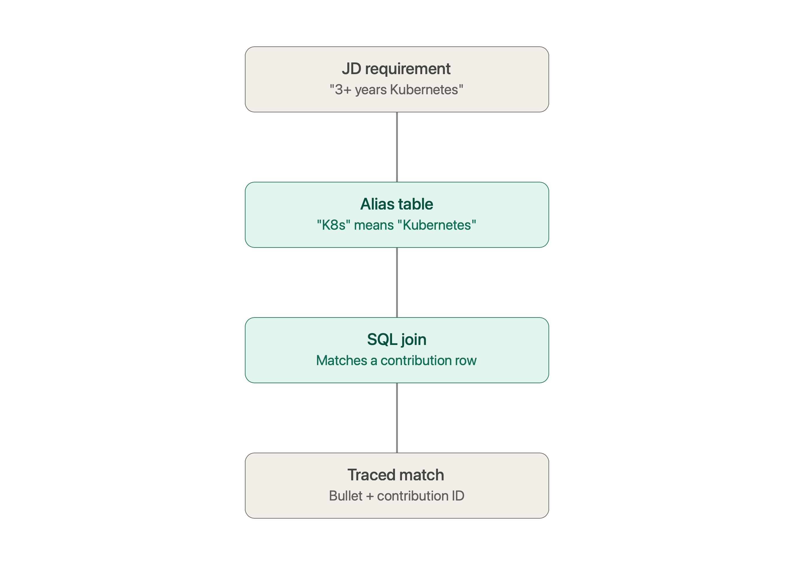

+++
date = '2026-09-01T20:45:47-04:00'
draft = true
title = 'Oops! All Ragtime!'
+++

I was trying to solve a problem, as you do. My effort to make an LLM-powered job and resume management
system, I realized that I needed to be able to pull apart a job description, figure out what it was
_really_ asking for, then match that somehow against a scattered career history to figure out what
parts of my unique background were actually relevant to that specific job. I wanted to be able to
tell, concretely, which piece or pieces of my history supported a particular requirement, and how.

I needed a database to handle all that structured data, so I got started on a schema.
Job contributions were tagged by skill, by domain, by employer, and by date. Job description
requirements that were extracted and normalized into the same vocabulary were stored in a separate table.
Then I wrote SQL joins to match one against the other, with an alias table to catch the inevitable cases
where a JD says "Kubernetes" and my own notes say "K8s," or where "led" and "owned" and "drove" all need
to mean roughly the same thing to the matching logic. Right off the bat it kinda worked. It was obvious
that it needed tuning, but I could see the potential and kept building.

Somewhere along the line, probably during one of my design sessions I found the term RAG. After I paused
to figure out what a RAG system was, I started trying to determine if what I was building matched the
description or not (the irony here isn't lost on me: that's precisely the type of functionality I was
building). Turns out that what I built really does match that definition.

Retrieval-Augmented Generation, if you haven't run into the term, is the general pattern where you
store information relevant to what your LLM is doing, and then pre-fetch that data before processing.
You then hand that data to the model as context when you ask it to generate an answer, and it uses the
context to do the work. Retrieval and generation are separate steps, and the quality of the latter depends
fully on the quality of the former.

Most current discussions of RAG you'll find assume that the retrieval step works a specific way. You embed
your documents as vectors, embed the query as a vector, find the nearest neighbors in vector space, and hand
those back as context. This is semantic search, and it's the default assumption baked into most tooling,
tutorials, and conversations about the pattern.

But, I didn't do any of that. My retrieval step is all in SQL. WHERE clauses, JOINs, and an alias table I
grew by hand every time a new vocabulary mismatch showed up in real job descriptions. No embeddings are anywhere
near the actual matching logic, which is just regular Go code. It might seem like I accidentally came to the
right conclusion, but I don't think it was really an accident at all.

Vector search earns its keep when you're searching across large amounts of unstructured text and you need
to find things that are conceptually related even when the words don't match. That's a real and hard problem,
and embeddings are a genuinely good answer to it. However, the data I'm working with isn't unstructured text.
It's job contributions (referred to in Role Model as contribution atoms) with real fields. They can have skill
tags, date ranges, employer, and category.

Structuring the data doesn't mean the semantic problem goes away, though. A JD asking for "3+ years of
Kubernetes in production" and my own notes saying that I've "deployed services to K8s on AWS" are talking about
the same thing, and that needs to be known by the system. The semantic matching still has to happen somewhere, 
and I moved it. Instead of asking an embedding model to infer that equivalence at query time, I wrote it down
myself in an alias table. The first time a real job description forced the question, I noticed the gap and
went back to the source data and updated it. "K8s" means "Kubernetes." Similarly, when thinking about owning
work, "Led," "owned," and "drove" should mean roughly the same thing to the matching logic.

The judgment is still semantic, but Role Model makes it explicit rather than implicit. A vector match can tell
you two things are similar, but it can't tell you why. It also can't really be inspected after the fact. My
aliases and JOIN tables can. Every equivalence is something I made a decision about and wrote down, not
something a model inferred and can't fully explain.

This structured retrieval gets me something that I wouldn't easily get from a vector search. When I show a
match between a JD requirement and my resume skills, I can follow the trace back to exactly which position
at which employer I got that match. Every bullet generated carries with it the ID of the job contribution 
it came from. A resume-generator that can't explain its own outputs isn't one that I would trust to describe
me to a hiring manager.

I didn't build it this way because I'd weighed vector search against structured retrieval and made a principled
choice. I built it this way because I didn't know vector search was the "normal" approach, and I reached for SQL
because that's the tool I've trusted for twenty-five years. It just so happens that the constraints of this
particular problem line up well with what SQL is good at, and not particularly well with what embeddings are
good at. I became the proverbial broken clock that is right twice a day.

This of course doesn't argue that vector search is bad, but it does make an argument that it solves a problem
that I don't have. If my career was a pile of unstructured notes and I needed to find conceptually related
experience across thousands of vague entries, I'd want embeddings. Mine isn't that, so I don't.

It won't stay that simple forever, though. Hand-writing every alias the first time a job description forces the
question doesn't scale indefinitely. There's a real case for using pgvector to help with identifying skill aliases
automatically instead of waiting for me to notice a mismatch and close the gap by hand. Right now, unresolved
terms get flagged for me to review, but a vector similarity search over that queue could suggest matches for me
to confirm rather than leaving me to spot every one myself.

The rule I started the design of Role Model with is that vectors get to help find things, but they never get to
dictate things. Any pgvector-assisted matching will stay upstream of the actual scoring logic, surfacing candidates
for a human to confirm, not replacing the deterministic SQL path that produces the final, auditable match.

Similarity retrieves candidates. Evidence establishes claims. Provenance establishes trust. The moment embeddings
start deciding whether a piece of my career history satisfies a job requirement instead of just suggesting that it
might, I lose the property that made this whole thing worth building to start with.
