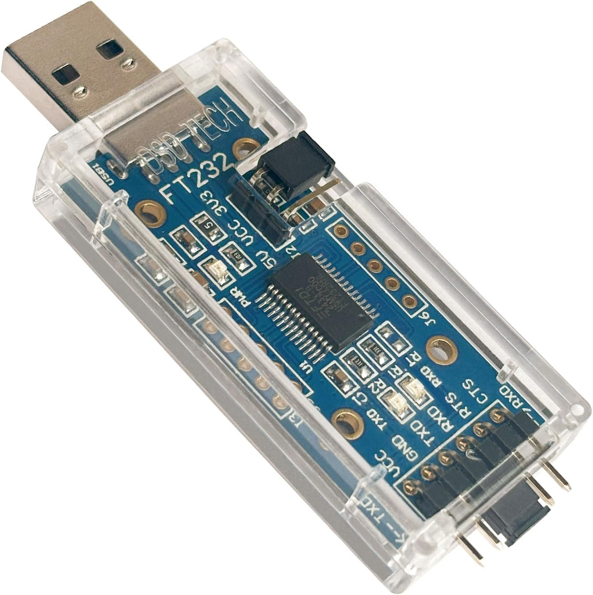
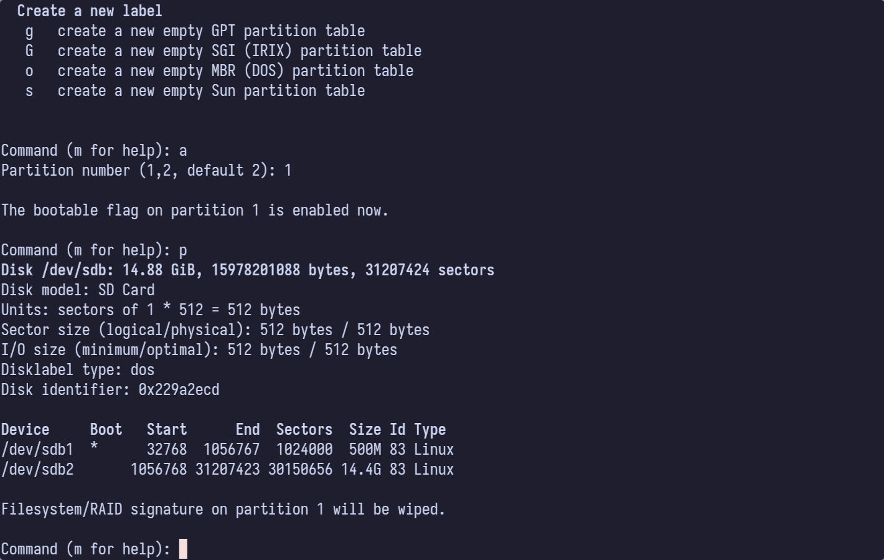

+++
date = '2026-05-28T17:57:24-04:00'
draft = false
title = 'Void Linux on NanoPI NEO3'
status = 'active'
github = ''
+++

# NanoPI NEO3 +Void == ??

A couple of years ago, I started playing around with the idea of a little homelab for tinkering with various applications. I
started very small with a single Raspberry Pi 4 and an external SSD, and expanded slowly from there. Along the way, I found myself
in possession of 4 [NanoPi NEO3](https://wiki.friendlyelec.com/wiki/index.php/NanoPi_NEO3) single board computers. I got mine from
Amazon, and they are actually manufactured by Youyeetoo, not FriendlyElec, but they are the same boards. I initially set them up
as a little Docker Swarm cluster, then a microK8s Kubernetes cluster. I never really used them much for that, and they kind of sat
for a long time powered down, waiting for me to get interested again.

Part of that homelab journey included a Proxmox host with plenty of capacity for various virtual machines, which was a distro
hopper's dream (nightmare?). I don't remember when or why I stumbled onto Void Linux, but I liked it. To the point of setting up a
desktop system running Void as my main Linux box. It's clean, Xbps works well from what I can tell, and I kind of vibe with the whole
'move on from systemd' thing these days. So, what does that have to do with the NanoPi SBCs?

## The NanoPI NEO3

I've been looking around for things I can use the NEO3 boards for. They just don't show up on Reddit or Youtube or any other platform
like Raspberry Pis or some other boards do. I've found that you can run [Armbian](http://armbian.com) and [DietPi](http://dietpi.com)
on them pretty well, and I like Debian just fine. What I haven't seen anywhere was proof of anyone running Void Linux on one of these
overgrown postage stamps. So, why not?

These are very compact and fairly capable machines:
- Rockchip rk3328 - Quad core Arm64 Cortex A53
- 2GB of DDR4 RAM
- 1Gb Ethernet with a real hardware MAC address
- A USB 3 port
- 2 more USB 2 ports on a header
- Micro SD card and quite a few GPIO pins
- 48X48mm form factor

They can do memory and cpu bound processing without too much trouble, and if you pair them with a USB 3.0 SSD, they can even do some data 
stuff. Not like a real server, but better than you might think when you first lay eyes on one. 

## Install Process

My plan is to have a bootable Void system using Das U-Boot as the bootloader, with the root filesystem mounted from a drive attached to the
USB3 port on the PCB. Since the rk3328 on this board can't boot directly from USB, I'll have to use an SD card to hold the bootloader and
the /boot filesystem, while putting everything else on the USB drive.

TODO: Put together a simple block diagram of the SSD with U-Boot in the first 32768 blocks.

I started from a working DietPi install to get an idea of what I was in for. 

1. Setup with DietPi
2. Move to a clean U-Boot build with a custom environment
3. Move / to USB

### Hardware Environment

Before getting to far into this, we should talk about how we're going to make all this work. I have the SBCs, but what else do you need for this
experiment? Well, these Rockchip SoC boards can't boot directly from USB or any other external media, so they require a micro SD card to use for
boot purposes. We'll install a bootloader there in a moment. The other three items you'll need are some way to access the micro SD card (I used
an Insignia branded USB-C SD/MicroSD card reader plugged into my little Beelink PC running Void. You'll also want to find some sort of USB 3 
flash drive or SSD. SSDs will obviously last longer and perform better, but a flash drive is ok for now. I bought a bunch of cheap 128GB SanDisk
Ultra Fit USB 3.1 drives from Amazon. They are tiny and will fit in the USB port on the NanoPi NEO3 perfectly well, even with the power and a
network cable attached. The root filesystem will be mounted from this USB thumb drive, but the bootloader is going to be on the micro SD card. I
chose some off-brand GIGASTONE cards with 16GB of space due to cost. Try to get fast and reliable cards for fewer headaches down the road. I
really like Samsung and SanDisk cards. I've heard that Lexar makes good ones, as well.

The last thing we're going to need to do this thing is a way to interface with the board. The NEO3 has gigabit ethernet, USB3, and all kinds of other
stuff on it, but what it does *not* have is any sort of video out. That means we have to do something else to get access to the U-Boot terminal and
the Linux console. Luckily, the board does have a serial debug port that allows the user to connect to it and see what's happening while it tries to 
start up. To connect to that port, accessed by a 3-pin header near the USB port, we will need a USB to RS232 serial port adapter. I bought a cheap
no name FTDI USB device that came with a Dupont cable to connect it to the board on one end.



### U-Boot

[Das U-Boot](u-boot.org) (typically referred to as u-boot) is the bootloader that I see used, if not always at least most of the time with Linux on
SBCs. I figured it made sense to stick with what works, so that's what I did. As you can imagine, since u-boot is super low level, it needs to
understand the hardware of the target system it is being asked to boot. This means we should probably build a clean version with the hardware
configuration in place.

I got most of the following from reading the official U-Boot [installation documentation](https://docs.u-boot.org/en/latest/build/gcc.html), *many*
times over. If anything is amiss or unclear, check there first.

#### Prerequisites

To build u-boot for the Rockchip 3328, you'll need an ARM 64 cross compiler toolchain. On Void, you install it with this:

```bash
> sudo xbps-install -Sy cross-aarch64-linux-gnu
```

There may be other packages you need to install, depending on your current system configuration. Here is a partial list of dependencies:

- flex
- bison
- Python 3

... and lots of other stuff that may or may not be installed already. If you're following along with this writeup, there's some expectation
that you can handle figuring out issues like missing packages, and fix them. No warranty is implied. YMMV and all that.

#### Build U-Boot

To build u-boot, we first have to get the source. 

```bash
> git clone https://source.denx.de/u-boot/u-boot.git
```

Once that finishes cloning, then we have to configure the build to match the NEO3's hardware configuration. The make system in the repository
has template configurations for currently maintained boards, and while there are a lot of them, there doesn't seem to be one specific to the 
NEO3. After some searching and reading on the web, I discovered that the FriendlyElec NanoPi R2S is very similar, and its u-boot configuration
can be safely used in place of a unique NEO3 version.

```bash
> make nanopi-r2s-rk3328_defconfig
```

After configuring the build, we have to compile the bootloader. For Rockchip SoCs, there is a bit of extra magic that we need to perform before we
can build. The compilation for our board requires Trusted Firmware when building, and we can download and build it with the following set of commands:

```bash
> git clone --depth 1 https://github.com/TrustedFirmware-A/trusted-firmware-a.git
> cd trusted-firmware-a
> make realclean
> sudo make CROSS_COMPILE=aarch64-linux-gnu- PLAT=rk3328 # Unusre why this only works for me as root
> cd ..
```

With that in place, we can compile the bootloader and get it ready to use. This is pretty straightforward and really only requires one extra
setup step. When cross-compiling, you have to tell Make what compiler to use. We do that by specifying the CROSS_COMPILE variable before invoking
`make`. Take note that the trailing - character is not a typo - without it, your build will fail immediately. The -j flag at the end tells make use
parallelization, using as many threads as there are processors available.

```bash
> cd u-boot
> export BL31=../trusted-firmware-a/build/rk3328/release/bl31/bl31.elf
> CROSS_COMPILE=aarch64-linux-gnu- make -j$(nproc)
```

When the build finishes, all that is left is to flash the bootloader onto the microSD card that we will use for this machine.

```bash
> sudo dd if=u-boot-rockchip.bin of=/dev/sda seek=64

  18262+0 records in
  18262+0 records out
  9350144 bytes (9.4 MB, 8.9 MiB) copied, 1.45766 s, 6.4 MB/s

> sync
```

The SD card is now bootable. It won't do anything because there's no OS to boot, but the bootloader will try its hardest to do just that.

#### U-Boot Boot environment (scripts)

I'm not qualified to give a full description of how the bootloader works to bring up the system, but I will go through the things that we need to know
in order to be successful. U-Boot configures the necessary hardware that the kernel will need, such as the RAM, the SD card reader, clock and power, and
importantly for this experiment, the serial console. It gets the hardware configuration information it needs from a binary data file called a Device Tree
Blob (DTB). This proved tricky for me to find, but I'll cover that part later. Once hardware is initialized, the bootloader runs a special boot script,
which we will use to tell it U-Boot how to load the kernel, the DTB, the inital RAMdisk image, and finally an environment file into memory, all before
booting the kernel with a set of configurable kernel command-line arguments.

After hardware initialization, U-Boot searches a set of known locations for a boot directory from where it can load its boot script. This is typically
on the first MMC device (the micro SD card in this case), in the /boot directory. I believe that it can handle FAT-derived filesystems, as well as some
well known Linux filesystems, such as EXT4. To prepare for installation, I partitioned the SD card so that it had a small FAT filesystem at the beginning
(after the U-Boot section of the card) to hold /boot, and an EXT4 partition on the rest of the card to contain my root filesystem (/). 



We need to write filesystems to the two partitions on the SD card so we can eventually perform our installation on it. 

```bash
> sudo mkfs.ext4 /dev/sdb1

> sudo mkfs.ext4 /dev/sdb2
```

##### DietPi and Armbian

Both DietPi and Armbian support this specific SBC to some degree, which means they both have boot environments that are known to work. To start with, I
downloaded DietPi and pulled the /boot directory out of the image to see what their setup looked like. The DietPi image included a kernel image, ramdisk
image, the DTB file, the boot.scr script, and an environment variable file called `dietpiEnv.txt`. There is a lot of other stuff in there, but none of it
is of much interest to us at this point.

```bash
.rw-r--r-- 3.1k root 21 Oct 07:47 boot.cmd
.rw-r--r-- 3.2k root 21 Oct 07:47 boot.scr
.rw-r--r--  371 root 21 Oct 07:47 dietpiEnv.txt
drwxr-xr-x    - root 21 Oct 07:47 dtb-6.12.35-current-rockchip64
.rw-r--r--  19M root 21 Oct 07:47 initrd.img-6.12.35-current-rockchip64
.rw-r--r--  38M root 21 Oct 07:47 vmlinuz-6.12.35-current-rockchip64
```

When I started this experiment, I initially used the environment from this image to try to get everything up and running. I modified the script and Env file
as needed to get the right configuration in place. I eventually had to give that up and do some more drastic ...

Armbian has a very similar structure. I've pasted the contents of its boot directory below, minus the bits that aren't of interest for this effort.

```bash

.rw-r--r--  178 root 21 Oct 07:48 armbianEnv.txt
.rw-r--r-- 3.8k root 21 Oct 07:48 boot.cmd
.rw-r--r-- 3.9k root 21 Oct 07:48 boot.scr
drwxr-xr-x    - root 21 Oct 07:48 dtb-6.12.47-current-rockchip64
.rw-r--r--  17M root 21 Oct 07:48 uInitrd-6.12.47-current-rockchip64
.rw-r--r--  38M root 21 Oct 07:48 vmlinuz-6.12.47-current-rockchip64
```

The part we need to modify to fit our needs are the boot script and the environment file. After early hardware initialization, one of the first things
that U-Boot does is locate and execute the special binary file, `boot.scr`. This file gets generated from the plaintext `boot.cmd` file, which I've included below.

```bash
# DO NOT EDIT THIS FILE
#
# Please edit /boot/dietpiEnv.txt to set supported parameters
#
# If you must, edit /boot/boot.cmd and recompile /boot/boot.scr with:
# mkimage -C none -A arm64 -T script -d /boot/boot.cmd /boot/boot.scr

# Default environment
setenv rootdev "/dev/mmcblk0p1"
setenv rootfstype "ext4"
setenv consoleargs "console=tty1"
setenv docker_optimizations "off"

# Load addresses
setenv scriptaddr "0x9000000"

# If this script was loaded from SD/eMMC, get PARTUUID of its first partition for later detection from userland
if test "${devtype}" = "mmc"; then part uuid mmc "${devnum}:1" partuuid; fi

# Load environment file
if load "${devtype}" "${devnum}" "${scriptaddr}" "${prefix}dietpiEnv.txt"; then
	env import -t "${scriptaddr}" "${filesize}"
fi

# Define kernel command-line arguments
setenv bootargs "root=${rootdev} rootfstype=${rootfstype} rootwait ${consoleargs} consoleblank=0 coherent_pool=2M partuuid=${partuuid} ${extraargs}"

# Add bootargs for Docker
if test "${docker_optimizations}" = "on"; then setenv bootargs "${bootargs} cgroup_enable=memory"; fi

# Load device tree and apply overlays
load "${devtype}" "${devnum}" "${fdt_addr_r}" "${prefix}dtb/${fdtfile}"
fdt addr "${fdt_addr_r}"
if test -n "${overlays}${user_overlays}"; then
	setenv overlay_error "false"
	fdt resize 65536
	for overlay in ${overlays}; do
		for pre in ${overlay_prefix}; do
			if test -e  "${devtype}" "${devnum}" "${prefix}dtb/${overlay_path}/overlay/${pre}-${overlay}.dtbo"; then
				if load "${devtype}" "${devnum}" "${scriptaddr}" "${prefix}dtb/${overlay_path}/overlay/${pre}-${overlay}.dtbo"; then
					echo "Applying kernel provided DT overlay ${pre}-${overlay}.dtbo"
					fdt apply "${scriptaddr}" || setenv overlay_error "true"
				fi
			fi
		done
	done

	for overlay in ${user_overlays}; do
		if load "${devtype}" "${devnum}" "${scriptaddr}" "${prefix}overlay-user/${overlay}.dtbo"; then
			echo "Applying user provided DT overlay ${overlay}.dtbo"
			fdt apply "${scriptaddr}" || setenv overlay_error "true"
		fi
	done

	if test "${overlay_error}" = "true"; then
		echo "Error applying DT overlays, restoring original DT"
		load "${devtype}" "${devnum}" "${fdt_addr_r}" "${prefix}dtb/${fdtfile}"
	else
		for pre in ${overlay_prefix}; do
			if test -e "${devtype}" "${devnum}" "${prefix}dtb/${overlay_path}/overlay/${pre}-fixup.scr"; then
				if load "${devtype}" "${devnum}" "${scriptaddr}" "${prefix}dtb/${overlay_path}/overlay/${pre}-fixup.scr"; then
					echo "Applying kernel provided DT fixup script ${pre}-fixup.scr"
					source "${scriptaddr}"
				fi
			fi
		done
		if test -e "${devtype}" "${devnum}" "${prefix}fixup.scr"; then
			if load "${devtype}" "${devnum}" "${scriptaddr}" "${prefix}fixup.scr"; then
				echo "Applying user provided DT fixup script fixup.scr"
				source "${scriptaddr}"
			fi
		fi
	fi
fi

# Load kernel and initramfs last, for U-Boot to set ${filesize}, needed to load raw initrd
load "${devtype}" "${devnum}" "${kernel_addr_r}" "${prefix}Image"
load "${devtype}" "${devnum}" "${ramdisk_addr_r}" "${prefix}initrd.img"

# Boot
booti "${kernel_addr_r}" "${ramdisk_addr_r}:${filesize}" "${fdt_addr_r}"

1. Describe the basics
2. Cover the DietPi (and Armbian) version
3. Add the target environment from the existing

```

```bash
rootdev=PARTUUID=3212f802-01
```

### Custom Kernel
From here on down, this article is going to get a little bit thin on details. I need to go and collect the 
details from when I first insalled Void so that I can update. Until then, I'll have some sections that are
basically nothing but a description of what is to come. 

I built a custom Linux Kernel to better support the hardware on the NEO3. More details to come.
#### Clone
#### .config
#### Build

### Void Linux Install
I followed a fairly standard Void install using the Chroot method from the
manual. I owe you one detailed breakdown of the installation process.

#### Filesystems
#### Chroot
#### My Configuration

I did have to enable a few services that weren't enabled by default: dhcpd/dhcpd-eth0, sshd, NTP daemon (chronyd)

### Post-install

After the initial boot, you're going to want to do some package installation and configuration of the base Void system to
make it fit your needs.

#### Void Packages
Packages installed:
- base-system-0.114_2
- btop-1.4.5_1
- chrony-4.7_1
- fastfetch-2.53.0_1
- neovim-0.11.4_1
- ntp-4.2.8p18_7

#### Use Cases

I have been trying to think of good uses for these little boards, and I have come up with a few that I like and might try.

##### Docker/Kubernetes Cluster

My initial use for them was as a little homelab cluster for experimenting with Kubernetes, Helm, and various other cluster
technologies. They will still be great for that use with Void instead of one of the Debian-based distros that are advertised 
to work. I thought about setting up a networked filesystem, running an \*Arr stack on them, or any number of other things 
(they would make a great pihole platform, if a little *over*powered). 

##### Fileserver

I have a capable fileserver running on an X86 PC at the moment, but I have in the past used an RPi4 with an external SSD to
serve up data to my network. Replace the USB drive I'm using with something more sturdy and with bigger capacity, and there is no
reason a NEO3 couln't serve the same purpose. They are very energy efficient, to boot.

##### Airplay Endpoint

The next project that I am planning is to set one of these up to run as an Airplay endpoint using shairport-sync, a DAC, and a pair
of powered speakers. Should be relatively cheap to implement, and kind of fun to play around with. I'm sure that I'll come up with
more projects to spend time and brain cycles on with the other 3 boards. It's kind of fun just trying to think of good ways to use
them.

### Next Steps?

I need to refine the process and insall Void on all 4 of these SBCs, 
documenting it more cleanly. I think an updated post, or maybe a part
II would then be in order. 

Overall, this was a lot of fun to play with, even if slightly frustrating
at times. I learned a lot about Linux boot, uboot, and Void. I definitely
recommend finding something weird that you want to see work, and make it 
happen. You'll probably have a good time and learn some stuff.

<!--
---

Pics to Get:

1. Couple of pics of a board (with case?)
2. The USB drive and SD cards
3. Serial FTDI whatever

Screenshots:
1. U-boot build?
2. Kernel config/build
3. fastfetch
4. Void login screen
5. Some of the install process
    1. Filesystems
    2. Chroot environment

Code Snippets:
1. boot.cmd
2. environment.txt
3. Kernel .config?

---

### TODO
- [X] Partition SD Card
- [X] Build U-Boot
- [X] Flash U-Boot
- [ ] Install Void using chroot
- [ ] Setup initial /boot
- [ ] Build & install Linux kernel
- [ ] Boot up install from SD card
- [ ] Post-install
- [ ] Optional - Partition & Format USB drive
- [ ] Optional - Move Void to USB
- [ ] Optional - Set up boot from USB
-->
